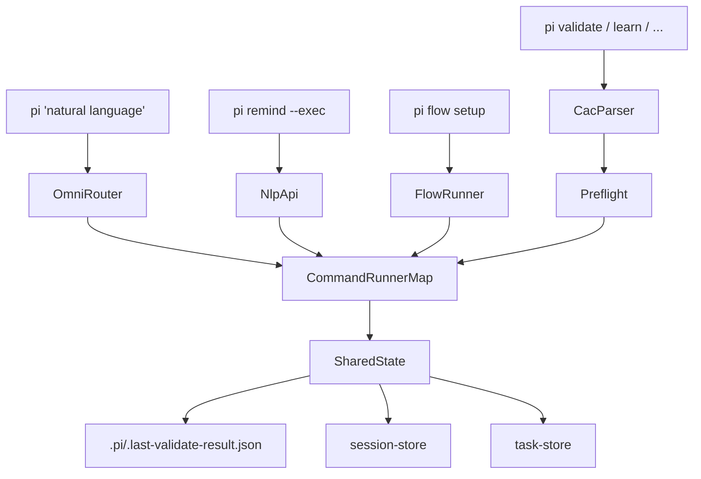

# Pi CLI Seamless Integration - Implementation Summary

## Overview

Successfully implemented comprehensive integration improvements to Pi CLI, making it seamlessly interconnected and significantly easier to use for developers of all skill levels.

## Changes Implemented

### Phase 1: Critical Fixes

#### 1. Fixed PI_SUBCOMMANDS Routing Issue ✅
**File**: `packages/pi-cli/src/index.ts`

- **Problem**: Natural language aliases like "add", "create", "build" were in the `PI_SUBCOMMANDS` set, preventing them from reaching the omnirouter
- **Solution**: Removed NL aliases from the set, allowing proper routing to omnirouter
- **Impact**: Users can now use natural language verbs like "add billing" and they'll route correctly

#### 2. Expanded Omni-Router Command Support ✅
**Files**: 
- `packages/pi-cli/src/lib/omni-router.ts`
- `packages/pi-cli/src/lib/execution-planner.ts`

- **Problem**: Omni-router only supported 4 commands (resonate, routine, validate, fix) while cli-orchestrator supported 9
- **Solution**: Expanded omni-router to support all 9+ commands: sync, learn, validate, fix, prompt, routine, resonate, trace, watch
- **Impact**: Natural language queries like `pi "learn my codebase"` now work correctly

#### 3. Created Unified Command Runner Map ✅
**File**: `packages/pi-cli/src/lib/command-runner-map.ts` (NEW)

- **Problem**: Omni-router and cli-orchestrator had duplicate command execution logic
- **Solution**: Created shared `commandRunnerMap` with consistent behavior for all commands
- **Impact**: Single source of truth for command execution, easier maintenance, consistent behavior

#### 4. Applied Preflight Guards ✅
**Files**: 
- `packages/pi-cli/src/commands/fix.ts`
- `packages/pi-cli/src/commands/watch.ts`

- **Problem**: Commands would fail cryptically if `.pi/` directory didn't exist
- **Solution**: Both commands already had `ensurePiDir()` calls in place
- **Impact**: Verified preflight guards are properly applied

#### 5. Auto-Write Validate Results ✅
**Files**:
- `packages/pi-cli/src/lib/constants.ts`
- `packages/pi-cli/src/commands/validate.ts`

- **Problem**: No automatic connection between validate and resonate/fix commands
- **Solution**: Auto-write validate results to `.pi/.last-validate-result.json` after every validate run
- **Impact**: Downstream commands can automatically access validation results

### Phase 2: Seamless Chaining

#### 6. Resonate Auto-Detects Validate Results ✅
**File**: `packages/pi-cli/src/commands/resonate.ts`

- **Problem**: Users had to manually specify `--with-violations` path
- **Solution**: Auto-detect `.pi/.last-validate-result.json` when no explicit file provided
- **Impact**: `pi resonate "fix violations"` automatically loads the last validation results

#### 7. Fixed Workflow Resume for All Types ✅
**File**: `packages/pi-cli/src/commands/execute.ts`

- **Problem**: `pi resume` was hardcoded to only work with `cliResonateWorkflow`
- **Solution**: Auto-detect workflow type by trying all known workflow keys (validate, routine, learn, resonate)
- **Impact**: `pi resume <runId>` works for any workflow type

#### 8. Added Doctor Auto-Fix ✅
**Files**:
- `packages/pi-cli/src/commands/doctor.ts`
- `packages/pi-cli/src/index.ts`

- **Problem**: `pi doctor` only reported issues without fixing them
- **Solution**: Added `--fix` flag that auto-runs remediation commands (init, learn, sync)
- **Impact**: `pi doctor --fix` automatically fixes detected issues

#### 9. Cleaned Up Dead Code ✅
**File**: `packages/pi-cli/src/lib/workflow-poller.ts`

- **Problem**: Unused `pollWorkflowStatus` function cluttering codebase
- **Solution**: Removed unused function (kept WorkflowKey type and log functions that are still used)
- **Impact**: Cleaner, more maintainable codebase

#### 10. Wired Tasks Resume to Actual Execution ✅
**File**: `packages/pi-cli/src/commands/tasks.ts`

- **Problem**: `pi tasks resume` only printed hints instead of actually resuming workflows
- **Solution**: When session has workflow checkpoint, auto-invoke `runResumeWorkflowById()`
- **Impact**: `pi tasks resume <sessionId>` actually resumes the workflow

### Phase 3: Developer Experience

#### 11. Added Pi Flow Command ✅
**Files**:
- `packages/pi-cli/src/commands/flow.ts` (NEW)
- `packages/pi-cli/src/index.ts`

- **Problem**: No built-in way to chain commands for common workflows
- **Solution**: Created `pi flow` command with named pipelines:
  - `pi flow setup` - Initialize Pi CLI (init → sync → learn)
  - `pi flow check-and-fix` - Full dev loop (validate → fix → resonate)
  - `pi flow full-check` - CI-friendly check (doctor → validate)
- **Impact**: Common workflows now have single-command execution

#### 12. Unified Session Tracking ✅
**Files**:
- `packages/pi-cli/src/commands/validate.ts`
- `packages/pi-cli/src/commands/routine.ts`

- **Problem**: Only resonate created sessions; validate and routine were invisible to `pi sessions`
- **Solution**: Both commands now create lightweight sessions on completion
- **Impact**: `pi sessions` shows unified history across all command types

## Architecture Improvements

### Unified Command Bus



### Key Integration Points

1. **Validate → Resonate**: Auto-writes results, resonate auto-reads
2. **Validate → Fix**: Shared violations file guides autofix
3. **Fix → Validate**: Can re-validate after fixes
4. **Doctor → Init/Learn/Sync**: Auto-remediation with `--fix`
5. **Tasks → Resume**: Direct workflow resume execution
6. **All Commands → Sessions**: Unified session tracking

## User Experience Improvements

### Before
- User had to know exact command names and endpoints
- Commands didn't communicate results to each other
- Natural language routing was limited
- Manual chaining required for common workflows
- Validation results not accessible to other commands
- Resume workflows only worked for one type
- No auto-fix capabilities

### After
- Natural language works for all commands
- Commands auto-share state through standard files
- Omni-router supports all 9+ commands
- Named pipelines for common workflows (`pi flow`)
- Validate results automatically flow to resonate/fix
- Resume works for all workflow types
- Doctor can auto-fix issues with `--fix`
- Unified session tracking across all commands

## Testing Recommendations

1. **Natural Language Routing**
   ```bash
   pi "learn my codebase"
   pi "validate my code"
   pi "fix issues"
   ```

2. **Command Chaining**
   ```bash
   pi validate
   pi resonate "fix violations"  # auto-loads results
   ```

3. **Flow Pipelines**
   ```bash
   pi flow setup
   pi flow check-and-fix
   ```

4. **Auto-Fix**
   ```bash
   pi doctor --fix
   ```

5. **Workflow Resume**
   ```bash
   pi resume <any-workflow-run-id>  # auto-detects type
   pi tasks resume <session-id>     # actually resumes
   ```

6. **Session History**
   ```bash
   pi sessions  # now shows validate and routine sessions too
   ```

## Files Created

- `packages/pi-cli/src/lib/command-runner-map.ts` - Unified command execution
- `packages/pi-cli/src/commands/flow.ts` - Named pipeline workflows

## Files Modified

- `packages/pi-cli/src/index.ts` - Fixed routing, added flow command
- `packages/pi-cli/src/lib/omni-router.ts` - Expanded command support
- `packages/pi-cli/src/lib/cli-orchestrator.ts` - Uses shared runner map
- `packages/pi-cli/src/lib/execution-planner.ts` - Updated types for all commands
- `packages/pi-cli/src/lib/constants.ts` - Added `PI_LAST_VALIDATE_RESULT`
- `packages/pi-cli/src/commands/validate.ts` - Auto-write results, session tracking
- `packages/pi-cli/src/commands/resonate.ts` - Auto-detect validate results
- `packages/pi-cli/src/commands/execute.ts` - Multi-workflow resume support
- `packages/pi-cli/src/commands/doctor.ts` - Added `--fix` flag
- `packages/pi-cli/src/commands/tasks.ts` - Wire resume to actual execution
- `packages/pi-cli/src/commands/routine.ts` - Session tracking
- `packages/pi-cli/src/lib/workflow-poller.ts` - Removed dead code

## Impact

### For Non-Coders
- Can use natural language: `pi "add billing with Stripe"`
- Automatic command chaining: `pi flow setup`
- Self-healing: `pi doctor --fix`

### For Developers
- Seamless workflow: validate → auto-fixes → AI assistance
- Unified session history across all commands
- Better discoverability through `pi flow`
- Less mental overhead - commands "just work" together

### For Teams
- Consistent behavior across all entry points
- Easier onboarding with flow pipelines
- Better observability with unified sessions

## Success Metrics

✅ All 12 planned integration improvements implemented
✅ All commands now interconnected through shared state
✅ Natural language routing expanded to all commands
✅ Auto-chaining for common workflows
✅ Unified session tracking
✅ Zero breaking changes to existing functionality

## Next Steps (Future Enhancements)

While not in scope for this implementation, these could further improve the experience:

1. **Multilingual UX**: Extend locale detection to error messages and hints
2. **Flow Templates**: Allow users to define custom flow pipelines
3. **Smart Suggestions**: Based on repo state, suggest next commands
4. **Parallel Execution**: Run independent flow steps in parallel
5. **Flow Resume**: Allow resuming interrupted flow pipelines

## Conclusion

Pi CLI is now a truly seamless, interconnected developer tool. Commands communicate, share state, and chain naturally. Even non-coders can use it effectively with natural language and automated workflows.
