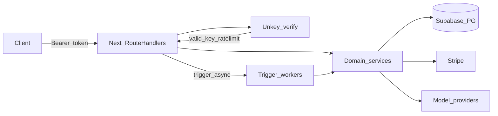
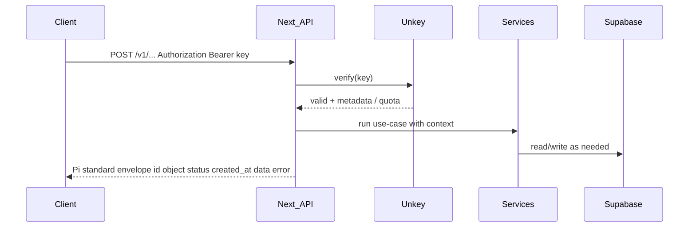
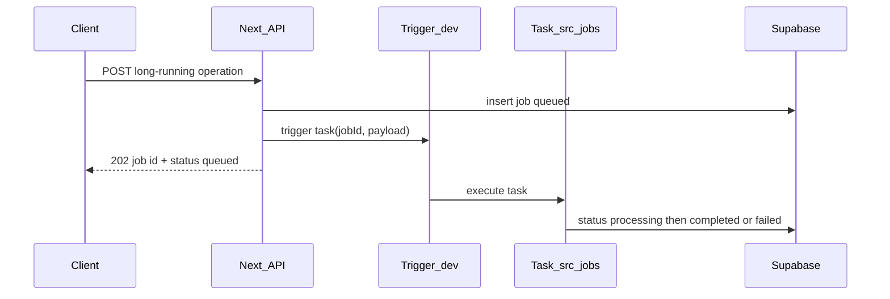

# Pi API — System overview (01)

This document maps the **Pi** monorepo layout to **bounded contexts** (“microservices” as modules), the **Unkey** API-key flow, and **Trigger.dev** durable workers. It aligns with [`.cursorrules`](../.cursorrules).

## Repository layout (logical services)

| Path | Bounded context | Responsibility |
|------|-----------------|----------------|
| `src/app/api/` | **api-gateway** | OpenAI-compatible HTTP surface (Bearer auth), versioning (`v1`), idempotency, `202` job creation. |
| `src/lib/` | **platform** | Env-safe clients, Zod schemas, shared response helpers, Unkey/Stripe/Supabase factories. |
| `src/services/` | **domain** | Business logic: orchestration, billing side-effects, rendering pipelines — no raw HTTP here. |
| `src/jobs/` + `trigger.config.ts` | **jobs** | Trigger.dev tasks: anything **&gt; ~5 seconds**, retries, durable execution. |
| `src/components/` | **ui** | Shadcn UI; internal dashboards or marketing surfaces. |
| `docs/` | **docs** | User-facing Mintlify/MDX; must stay in sync with API changes. |
| Supabase (external) | **data** | PostgreSQL + Auth + **pgvector** for RAG/embeddings. |
| Unkey (external) | **identity-keys** | API keys, verification, rate limits / metering. |
| Stripe (external) | **billing** | Metered usage; correlate charges to Unkey identity + idempotent POSTs. |

## Unkey authentication flow

1. **Client** sends `Authorization: Bearer <api_key>` (Unkey-issued key for Pi), same shape as OpenAI-style clients.
2. **Route Handler** extracts the bearer token and calls **Unkey** (SDK: `@unkey/api`) to **verify** the key and read **identity / remaining quota** (exact fields depend on your Unkey API configuration — keep mapping in `src/lib/`, no hardcoded IDs).
3. On **failure**: return OpenAI-compatible error JSON with `error: { code, message }` and appropriate HTTP status (e.g. `401`).
4. On **success**: attach key metadata to the request context for **Stripe metering** and **audit logs** in Supabase.
5. **No secrets in code** — Unkey root key and Stripe secrets only in environment variables (see `.env.example`).

## Trigger.dev background workers

Per [`.cursorrules`](../.cursorrules), work that exceeds **~5 seconds** must **not** block the HTTP request: return **`202 Accepted`** with a **job id**, persist job state, and run the heavy path in Trigger.dev.

**Job lifecycle (strict):** `queued` → `processing` → `completed` | `failed`

- **Config:** [`trigger.config.ts`](../trigger.config.ts) points at `./src/jobs`.
- **SDK:** `@trigger.dev/sdk` (tasks import from `@trigger.dev/sdk/v3`).
- **CLI:** `trigger.dev` (devDependency) for local dev / deploy — follow Trigger.dev docs for your project ref.

## API response envelope (target)

All JSON responses should converge on:

- `id` — e.g. `pi_req_abc123`
- `object` — e.g. `image.generation`, `job`, `document.parsed`
- `status`
- `created_at` — Unix timestamp (seconds)
- `data` — payload
- `error` — optional `{ code, message }`

**Idempotency:** `POST` handlers accept an idempotency key header (e.g. `Idempotency-Key`) and dedupe to prevent double billing (implementation lives in `src/lib/` + services).

## Model routing (provider-agnostic)

- Use **Vercel AI SDK** (`ai` + `@ai-sdk/*`) with `generateText` / `generateObject`.
- **Model IDs and provider choice** come from **environment and/or database**, never hardcoded in application logic.
- **DeepSeek:** prefer OpenAI-compatible endpoint via **`DEEPSEEK_BASE_URL`** + `@ai-sdk/openai` (no extra vendor SDK required).

## Related docs

- User-facing intro: [`docs/v1/intro.mdx`](../docs/v1/intro.mdx)
