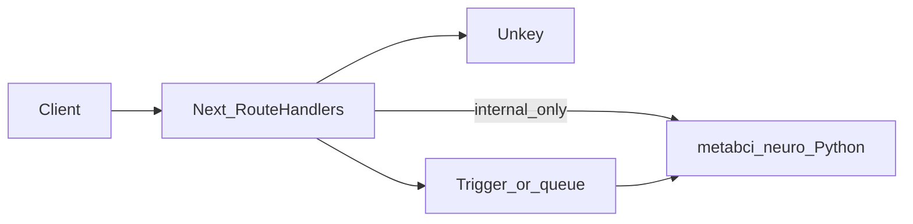

# Health / neuro overview (MetaBCI + imaging)

This note extends [01-system-overview.md](./01-system-overview.md) with **bounded contexts** for EEG / BCI (**MetaBCI**), **medical imaging** (**MONAI**), and **reference** material for **optional medical / therapeutic LLMs** (**HuatuoGPT**, **MedGemma**, **TxGemma** — not in-repo services unless you add workers).

## Bounded context

| Path | Context | Responsibility |
|------|---------|------------------|
| `services/metabci-neuro/` | **neuro-python** | MetaBCI + **Braindecode** + **MOABB**: BCI pipelines, benchmarks, online acquisition, PyTorch decoders; **not** deployed as part of the Next.js bundle. |
| `services/monai-imaging/` | **imaging-python** | **MONAI** (`monai[fire]`): Core + Model Zoo bundle downloads, imaging pipelines; **not** deployed as part of the Next.js bundle. |
| `src/app/api/v1/` (future `health` / `neuro` routes) | **api-gateway** | Bearer auth, Zod validation, OpenAI-style envelopes, **202** jobs for long work. |
| `src/jobs/` + Trigger.dev | **jobs** | Optional orchestration that invokes the Python service or polls job state. |
| Self-hosted inference (vLLM / SGLang / etc.) | **medical-llm (optional)** | **HuatuoGPT** ([`huatuogpt.md`](../docs/integrations/huatuogpt.md)); not vendored in-repo; env-routed only. |
| Vertex AI / HF / GCP containers | **google-hai-def (optional)** | **MedGemma** ([`medgemma.md`](../docs/integrations/medgemma.md)), **TxGemma** ([`txgemma.md`](../docs/integrations/txgemma.md)); [HAI-DEF terms](https://developers.google.com/health-ai-developer-foundations/terms); env-routed only. |

## Data flow (target)

## Documentation and rules

- Integration reference: [docs/integrations/metabci.md](../docs/integrations/metabci.md), [docs/integrations/braindecode.md](../docs/integrations/braindecode.md), [docs/integrations/moabb.md](../docs/integrations/moabb.md), [docs/integrations/monai.md](../docs/integrations/monai.md), [docs/integrations/huatuogpt.md](../docs/integrations/huatuogpt.md), [docs/integrations/medgemma.md](../docs/integrations/medgemma.md), [docs/integrations/txgemma.md](../docs/integrations/txgemma.md)
- Cursor guidance: `.cursor/rules/metabci-health-neuro.mdc`, `.cursor/rules/monai-health-imaging.mdc`, `.cursor/rules/huatuogpt-medical-llm.mdc`, `.cursor/rules/google-health-ai-gemma.mdc`

## Deployment note

Do not run MetaBCI or MONAI training / heavy inference on **Vercel serverless functions** as the primary runtime. Use **containers** (see `services/metabci-neuro/Dockerfile` for full stack, `Dockerfile.api` for decode/online-only; `services/monai-imaging/Dockerfile` for MONAI) or equivalent compute with sufficient **CPU/RAM** and optional **GPU** (see lockfile / PyTorch notes in each integration doc). **MedGemma** / **TxGemma** serving (HF local, **Vertex AI** Model Garden, vLLM, or batch jobs) should follow the same principle: **dedicated GPU or managed inference**, not ad-hoc serverless as the primary path for large models.

## Reminder (locks, Windows, CI)

- **`requirements.lock.txt` is Linux-only.** Native **Windows** installs from that lock often fail (Qt / PsychoPy wheels). Use **WSL2** or **`pip install -e ".[dev]"`** in `services/metabci-neuro` on Windows.
- **GitHub Actions** (`.github/workflows/metabci-neuro-smoke.yml`) validates **`requirements-api.lock.txt`** on **`ubuntu-latest`** (slim `brainda`+`brainflow` set).
- Prefer **`requirements-api.lock.txt`** + **`Dockerfile.api`** for **Pi neuro HTTP / worker** images; use the full lock + **`Dockerfile`** when **brainstim** / lab tooling is required.
- **MONAI:** `.github/workflows/monai-imaging-smoke.yml` validates **`requirements-ci.lock.txt`** (PyTorch **CPU**). GPU-oriented **`requirements.lock.txt`** is for Linux hosts that need default CUDA-related torch resolution (see `services/monai-imaging/README.md`).
