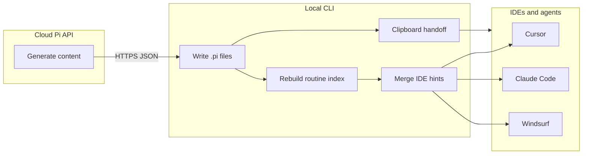

# Pi CLI — file management and agent handoff

This document describes how the **Pi CLI** (local Node.js) owns the filesystem while the **Pi API** (cloud) only returns structured payloads. It also explains how Pi nudges **Cursor**, **Claude Code**, **Windsurf**, and other agentic tools without wasting tokens.

## Trust boundary

| Layer | Responsibility |
|--------|------------------|
| Cloud (Next.js + Mastra / workflows) | Generates JSON / markdown **content** only. Never writes to the developer disk. |
| Local CLI (`@pi-api/cli`) | Writes under the repo, primarily **`.pi/`** (routines, system style, cache, resonance). |
| IDE / terminal agents | Read files the developer (or Pi) points them at. Pi cannot force an agent to read a file; it can **surface paths** and **merge small rule blocks** into known config files. |

## `.pi/` layout (conventions)

- **`.pi/system-style.json`** — output of `pi learn` (repo “DNA”).
- **`.pi/constitution.md`** — scaffolded by `pi init` (project rules).
- **`.pi/routines/`** — routine markdown (`<slug>.v<n>.md`) plus **`.pi/routines/.index.json`** (library index from `pi routine index`).
- **`.pi/.cache/`** — Rasengan L2 cache (deterministic validate snippets).
- **`.pi/prompt-cache/`** — last compiled prompts per intent slug (`pi prompt`).
- **`.pi/resonance/`** — `pi resonate` transcripts.

Optional agent adapters (when using `pi routine ... --format ...`):

- **`.cursor/rules/<slug>.mdc`** — Cursor rules from `pi-routine-spec`.
- **`.pi/adapters/claude/<slug>.md`** — Claude-oriented text.
- **`.windsurf/rules/<slug>.md`** — Windsurf rules.

## How files are written

- **Libraries:** Node `fs/promises`, `path`, **`fast-glob`** (scanning), **`clipboardy`** (handoff), **`chalk`** (UX). No `fs-extra` is required; `fs.mkdir(..., { recursive: true })` is sufficient.
- **`pi init`** — creates directories and stub `system-style.json` / `constitution.md` ([`packages/pi-cli/src/commands/init.ts`](../../packages/pi-cli/src/commands/init.ts)).
- **`pi learn`** — POST metadata to API, writes **`.pi/system-style.json`**, then refreshes **agentic IDE hints** (see below).
- **`pi routine`** — POST intent + context, writes **`.pi/routines/<slug>.v<n>.md`**, rebuilds **`.index.json`**, optional adapter files, then **handoff** (clipboard + console) and **targeted** IDE injection.

## Agentic IDE injection (token-aware)

Module: [`packages/pi-cli/src/lib/agentic-ide-injector.ts`](../../packages/pi-cli/src/lib/agentic-ide-injector.ts).

Pi merges a **single marked section** (`<!-- PI_CLI_START -->` … `<!-- PI_CLI_END -->`) into files that already exist where possible:

| Target | When updated |
|--------|----------------|
| `.cursorrules` | If the file exists |
| `CLAUDE.md` | If present (Claude Code project memory) |
| `.claude/CLAUDE.md` | If present |
| `.clinerules` | Created or updated (Pi-owned snippet) |
| `.windsurf/rules/pi-context.md` | Created or updated (Windsurf “always” rule stub) |

**Routine lists are never “dump everything”.** After `pi routine`:

1. **Primary** file: `.pi/routines/<slug>.v<version>.md`.
2. **Linked routines only:** YAML `references` on the primary routine (via `.index.json`) **plus** optional API fields `inject_routine_ids`, `related_routine_slugs`, `routine_dependencies` (merged, de-duplicated, **capped**).

## UI/UX knowledge pack (embedded templates)

Pi CLI can ship **docs-as-routines** as embedded templates, so teams can install a **token-safe UI/UX playbook** into `.pi/routines/` and reference only the relevant modules for a given task.

Recommended usage:

```bash
pi routine import ui-ux-playbook
pi routine search "aesthetic usability"
pi routine search "ux metrics"
```

Why this is token-safe:
- You import a **hub** routine (`ui-ux-playbook`) which references a few **leaf** routines.
- IDE injection only includes the **primary routine + referenced routines**, and is capped.

Disable all injection + IDE merges:

```bash
set PI_CLI_NO_AGENTIC_INJECT=1
```

## Smart detection helper (optional / future)

[`packages/pi-cli/src/lib/routine-context-detector.ts`](../../packages/pi-cli/src/lib/routine-context-detector.ts) scores routines from **branch name tokens** and **changed paths vs `files_manifest`** (`changedFileMatchesManifest`). It is capped (default 5) so auto-suggestions stay small. `pi routine` uses the **explicit** path set above, not a blind folder listing.

## Handoff: Cursor vs terminal agents

- **`pi prompt`** — compiles text, copies to clipboard on TTY, prints paste targets for Cursor / Windsurf / terminal agents.
- **`pi routine`** — copies a short multi-line handoff listing **only** the routine paths Pi considers in-scope for that run.

Agents do not “listen” automatically; the developer pastes or opens the paths Pi prints. Injection only **reminds** IDEs of `.pi/system-style.json`, `.pi/constitution.md`, and **explicit** routine paths for the current task.

## `pi validate` / `pi check`

The CLI prints which **system-style**, **constitution**, and **routine** artifacts apply before running local + cloud validation ([`packages/pi-cli/src/commands/validate.ts`](../../packages/pi-cli/src/commands/validate.ts)).

## Summary


