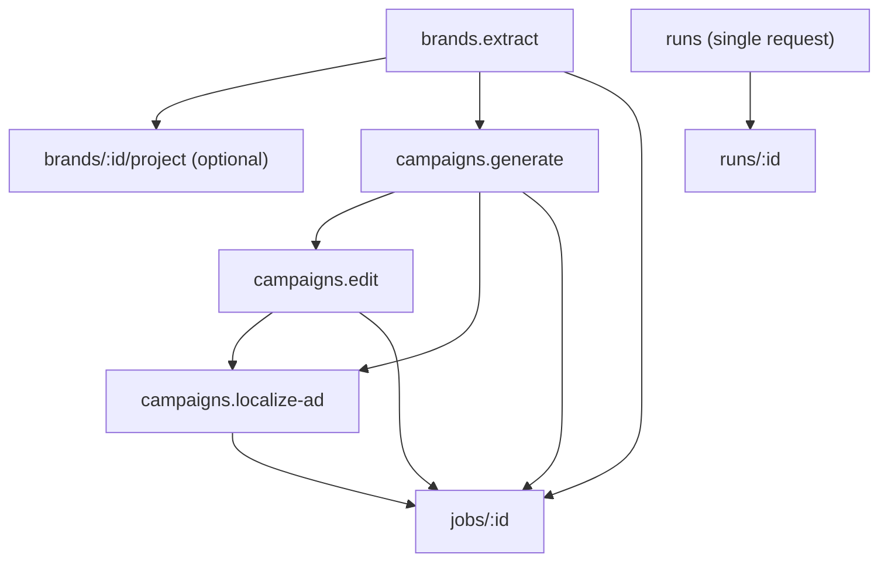

# Pipeline Orchestration Guide

This guide shows developers how to use Pi APIs **together**:

- `POST /api/v1/brands/extract`
- `POST /api/v1/brands/:id/project`
- `POST /api/v1/campaigns/generate`
- `POST /api/v1/campaigns/edit`
- `POST /api/v1/campaigns/localize-ad`
- `POST /api/v1/runs` (single-request orchestration)

You can orchestrate in two ways:

1. **Manual chaining** (call each endpoint yourself, step by step).
2. **Runs API** (declare a pipeline DAG once, Pi executes it).

## When to use each approach

- Use **manual chaining** when you need custom business logic between steps.
- Use **Runs API** when you want one request from your app/agent and built-in step tracking.

## Recipes (copy/paste run templates)

These are ready-made `/api/v1/runs` request bodies. Copy one JSON block and send it to `POST /api/v1/runs`.

### How to run a recipe (curl)

```bash
export BASE="https://api.example.com"
export API_KEY="pi_live_***"

# Create a run (paste JSON payload into -d)
run_id=$(curl -sS -X POST "$BASE/api/v1/runs" \
  -H "Authorization: Bearer $API_KEY" \
  -H "Content-Type: application/json" \
  -d @run.json | jq -r '.data.run_id')

# Wait for completion (long-poll, 20s per request)
curl -sS "$BASE/api/v1/runs/$run_id?wait_for_completion=true&timeout_seconds=20" \
  -H "Authorization: Bearer $API_KEY"
```

#### Notes

- `input_map` syntax: `$steps.<step_id>.result.<field>`
- For parallelization: create multiple steps with the same `depends_on` list.

---

### Recipe 1: Extract -> Generate -> 3 localizations (parallel)

```json
{
  "steps": [
    {
      "id": "extract_brand",
      "action": "brands.extract",
      "input": { "url": "https://example.com" }
    },
    {
      "id": "generate_base",
      "action": "campaigns.generate",
      "depends_on": ["extract_brand"],
      "input": {
        "prompt": "Create a hero campaign ad for the brand (premium, minimal, high-contrast)",
        "output": { "aspect_ratio": "4:5", "resolution": "1K", "thinking_intensity": "high" }
      },
      "input_map": {
        "brand_id": "$steps.extract_brand.result.brand_id"
      }
    },
    {
      "id": "localize_fr",
      "action": "campaigns.localize_ad",
      "depends_on": ["generate_base"],
      "input": {
        "prompt": "Keep composition exactly. Localize copy, cultural cues, and currency.",
        "target_culture": "French urban premium lifestyle",
        "target_language": "fr",
        "target_currency": "EUR"
      },
      "input_map": {
        "source_job_id": "$steps.generate_base.result.job_id",
        "brand_id": "$steps.extract_brand.result.brand_id"
      }
    },
    {
      "id": "localize_ar",
      "action": "campaigns.localize_ad",
      "depends_on": ["generate_base"],
      "input": {
        "prompt": "Keep composition exactly. Localize copy, cultural cues, and currency.",
        "target_culture": "Gulf luxury lifestyle",
        "target_language": "ar",
        "target_currency": "AED"
      },
      "input_map": {
        "source_job_id": "$steps.generate_base.result.job_id",
        "brand_id": "$steps.extract_brand.result.brand_id"
      }
    },
    {
      "id": "localize_rw",
      "action": "campaigns.localize_ad",
      "depends_on": ["generate_base"],
      "input": {
        "prompt": "Keep composition exactly. Localize copy, cultural cues, and currency.",
        "target_culture": "East African, Kigali premium lifestyle",
        "target_language": "rw",
        "target_currency": "RWF"
      },
      "input_map": {
        "source_job_id": "$steps.generate_base.result.job_id",
        "brand_id": "$steps.extract_brand.result.brand_id"
      }
    }
  ],
  "metadata": {
    "recipe": "extract-generate-localize-3"
  }
}
```

---

### Recipe 2: Generate -> 2 edits -> Localize best (sequential refinement)

Use this when you already have the prompt direction and want iterative creative control.

```json
{
  "steps": [
    {
      "id": "generate_base",
      "action": "campaigns.generate",
      "input": {
        "prompt": "Hero ad for premium hydration brand, minimal background, strong CTA",
        "output": { "aspect_ratio": "4:5", "resolution": "1K", "thinking_intensity": "high" }
      }
    },
    {
      "id": "edit_v1",
      "action": "campaigns.edit",
      "depends_on": ["generate_base"],
      "input": {
        "prompt": "Change environment to rooftop sunset; keep product placement and layout identical"
      },
      "input_map": {
        "source_job_id": "$steps.generate_base.result.job_id"
      }
    },
    {
      "id": "edit_v2",
      "action": "campaigns.edit",
      "depends_on": ["edit_v1"],
      "input": {
        "prompt": "Increase contrast, reduce background clutter, keep text legibility high"
      },
      "input_map": {
        "source_job_id": "$steps.edit_v1.result.job_id"
      }
    },
    {
      "id": "localize_best",
      "action": "campaigns.localize_ad",
      "depends_on": ["edit_v2"],
      "input": {
        "prompt": "Keep composition exactly. Localize to market while preserving product size and CTA hierarchy.",
        "target_culture": "East African, Kigali premium lifestyle",
        "target_language": "rw",
        "target_currency": "RWF"
      },
      "input_map": {
        "source_job_id": "$steps.edit_v2.result.job_id"
      }
    }
  ],
  "metadata": {
    "recipe": "generate-edit-edit-localize"
  }
}
```

---

### Recipe 3: Extract -> Generate (inline brand) -> Localize

If you already have brand identity as JSON, skip extraction and pass it inline to generation:

```json
{
  "steps": [
    {
      "id": "generate_base",
      "action": "campaigns.generate",
      "input": {
        "prompt": "Create a premium hero campaign ad using the brand identity",
        "brand_identity_json": {
          "primary_background_hex": "#FFFFFF",
          "primary_accent_hex": "#0071E3",
          "typography_rules": "Use a clean sans-serif with high contrast and clear hierarchy.",
          "core_slogan": "Build with confidence"
        },
        "output": { "aspect_ratio": "4:5", "resolution": "1K" }
      }
    },
    {
      "id": "localize_fr",
      "action": "campaigns.localize_ad",
      "depends_on": ["generate_base"],
      "input": {
        "prompt": "Keep composition exactly. Localize copy/culture/currency.",
        "target_culture": "French urban premium",
        "target_language": "fr",
        "target_currency": "EUR"
      },
      "input_map": {
        "source_job_id": "$steps.generate_base.result.job_id"
      }
    }
  ],
  "metadata": {
    "recipe": "inline-brand-generate-localize"
  }
}
```

## Common architecture



---

## Use Case 1: Global campaign launch

Goal:

1. Extract brand from website.
2. Generate a base campaign ad.
3. Produce localized variants in parallel (French, Arabic, Kinyarwanda).

### Manual chaining flow

1. `brands.extract` -> `job_id`
2. Poll `/jobs/:id?expand=brand` -> `brand_id`
3. `campaigns.generate` with `brand_id` -> `job_id`
4. Poll generate job -> `image_url`
5. Call `campaigns/localize-ad` multiple times:
   - either with `source_job_id` (recommended)
   - or with `source_image_url`
6. Poll localization jobs

### cURL example

```bash
export BASE="https://api.example.com"
export API_KEY="pi_live_***"

# 1) Extract brand
extract_job_id=$(curl -sS -X POST "$BASE/api/v1/brands/extract" \
  -H "Authorization: Bearer $API_KEY" \
  -H "Content-Type: application/json" \
  -d '{"url":"https://example.com"}' | jq -r '.data.job_id')

# 2) Wait for extraction and get brand id
brand_id=$(curl -sS "$BASE/api/v1/jobs/$extract_job_id?wait_for_completion=true&timeout_seconds=30&expand=brand" \
  -H "Authorization: Bearer $API_KEY" | jq -r '.data.job_result.brand.id')

# 3) Generate base campaign
generate_job_id=$(curl -sS -X POST "$BASE/api/v1/campaigns/generate" \
  -H "Authorization: Bearer $API_KEY" \
  -H "Content-Type: application/json" \
  -d "{
    \"prompt\":\"Premium hero ad for summer launch\",
    \"brand_id\":\"$brand_id\",
    \"output\":{\"aspect_ratio\":\"4:5\",\"resolution\":\"1K\"}
  }" | jq -r '.data.job_id')

# 4) Localize to French using source_job_id
fr_job_id=$(curl -sS -X POST "$BASE/api/v1/campaigns/localize-ad" \
  -H "Authorization: Bearer $API_KEY" \
  -H "Content-Type: application/json" \
  -d "{
    \"prompt\":\"Keep composition exactly the same\",
    \"source_job_id\":\"$generate_job_id\",
    \"target_culture\":\"French urban premium\",
    \"target_language\":\"fr\",
    \"target_currency\":\"EUR\",
    \"brand_id\":\"$brand_id\"
  }" | jq -r '.data.job_id')

# 5) Poll localized result
curl -sS "$BASE/api/v1/jobs/$fr_job_id?wait_for_completion=true&timeout_seconds=30&expand=ad" \
  -H "Authorization: Bearer $API_KEY"
```

---

## Use Case 2: Iterative creative refinement

Goal:

1. Generate one campaign ad.
2. Run several edits in sequence.
3. Localize the best edited result.

### Why this now works well

- `campaigns/edit` accepts `source_job_id` for **generation** and **previous edit** jobs.
- `localize-ad` accepts `source_job_id`, so no manual image URL extraction is required.

### JavaScript (`fetch`) example

```ts
const BASE = process.env.PI_BASE_URL ?? "https://api.example.com";
const API_KEY = process.env.PI_API_KEY!;

async function pi(path: string, init: RequestInit = {}) {
  const res = await fetch(`${BASE}${path}`, {
    ...init,
    headers: {
      Authorization: `Bearer ${API_KEY}`,
      "Content-Type": "application/json",
      ...(init.headers ?? {}),
    },
  });
  const json = await res.json();
  if (!res.ok) throw new Error(`${json?.error?.code ?? res.status}: ${json?.error?.message ?? "request failed"}`);
  return json;
}

async function waitJob(jobId: string, expand?: "ad" | "brand") {
  return pi(`/api/v1/jobs/${jobId}?wait_for_completion=true&timeout_seconds=30${expand ? `&expand=${expand}` : ""}`);
}

async function run() {
  const gen = await pi("/api/v1/campaigns/generate", {
    method: "POST",
    body: JSON.stringify({
      prompt: "Hero ad for premium hydration brand",
      output: { aspect_ratio: "4:5", resolution: "1K" },
    }),
  });

  const genJobId = gen.data.job_id as string;
  await waitJob(genJobId, "ad");

  const edit1 = await pi("/api/v1/campaigns/edit", {
    method: "POST",
    body: JSON.stringify({
      source_job_id: genJobId,
      prompt: "Change environment to rooftop sunset, preserve product placement",
    }),
  });

  const edit1JobId = edit1.data.job_id as string;
  await waitJob(edit1JobId, "ad");

  const edit2 = await pi("/api/v1/campaigns/edit", {
    method: "POST",
    body: JSON.stringify({
      source_job_id: edit1JobId, // edit-of-edit chain
      prompt: "Increase contrast and simplify background clutter",
    }),
  });

  const edit2JobId = edit2.data.job_id as string;
  await waitJob(edit2JobId, "ad");

  const localize = await pi("/api/v1/campaigns/localize-ad", {
    method: "POST",
    body: JSON.stringify({
      source_job_id: edit2JobId,
      prompt: "Keep same composition and product size",
      target_culture: "East African, Kigali premium lifestyle",
      target_language: "rw",
      target_currency: "RWF",
    }),
  });

  const localized = await waitJob(localize.data.job_id, "ad");
  console.log("Localized image:", localized.data.ad?.image_url ?? localized.data.payload?.image_url);
}

void run();
```

---

## Use Case 3: Single request orchestration with `/runs`

Goal: Developer or AI agent sends **one request** and receives a tracked multi-step run.

### Example run definition

```json
{
  "steps": [
    {
      "id": "extract_brand",
      "action": "brands.extract",
      "input": { "url": "https://example.com" }
    },
    {
      "id": "generate_base",
      "action": "campaigns.generate",
      "depends_on": ["extract_brand"],
      "input": {
        "prompt": "Launch visual for premium sparkling water"
      },
      "input_map": {
        "brand_id": "$steps.extract_brand.result.brand_id"
      }
    },
    {
      "id": "localize_fr",
      "action": "campaigns.localize_ad",
      "depends_on": ["generate_base"],
      "input": {
        "prompt": "Keep composition exactly",
        "target_culture": "French urban premium",
        "target_language": "fr",
        "target_currency": "EUR"
      },
      "input_map": {
        "source_job_id": "$steps.generate_base.result.job_id"
      }
    },
    {
      "id": "localize_ar",
      "action": "campaigns.localize_ad",
      "depends_on": ["generate_base"],
      "input": {
        "prompt": "Keep composition exactly",
        "target_culture": "Gulf luxury lifestyle",
        "target_language": "ar",
        "target_currency": "AED"
      },
      "input_map": {
        "source_job_id": "$steps.generate_base.result.job_id"
      }
    }
  ],
  "metadata": {
    "pipeline": "global-launch-q3"
  }
}
```

### Python example

```python
import os
import requests

BASE = os.environ.get("PI_BASE_URL", "https://api.example.com").rstrip("/")
API_KEY = os.environ["PI_API_KEY"]
H = {"Authorization": f"Bearer {API_KEY}", "Content-Type": "application/json"}

create_payload = {
    "steps": [
        {"id": "extract_brand", "action": "brands.extract", "input": {"url": "https://example.com"}},
        {
            "id": "generate_base",
            "action": "campaigns.generate",
            "depends_on": ["extract_brand"],
            "input": {"prompt": "Launch visual for premium sparkling water"},
            "input_map": {"brand_id": "$steps.extract_brand.result.brand_id"},
        },
        {
            "id": "localize_fr",
            "action": "campaigns.localize_ad",
            "depends_on": ["generate_base"],
            "input": {
                "prompt": "Keep composition exactly",
                "target_culture": "French urban premium",
                "target_language": "fr",
                "target_currency": "EUR",
            },
            "input_map": {"source_job_id": "$steps.generate_base.result.job_id"},
        },
    ]
}

r = requests.post(f"{BASE}/api/v1/runs", json=create_payload, headers=H, timeout=60)
r.raise_for_status()
run_id = r.json()["data"]["run_id"]

while True:
    rr = requests.get(
        f"{BASE}/api/v1/runs/{run_id}",
        params={"wait_for_completion": "true", "timeout_seconds": 20},
        headers={"Authorization": f"Bearer {API_KEY}"},
        timeout=120,
    )
    rr.raise_for_status()
    run = rr.json()["data"]
    if run["status"] in ("completed", "failed", "cancelled"):
        print("Run status:", run["status"])
        print("Steps:", run["steps"])
        break
```

---

## Input/output mapping reference

### Step result fields commonly used in `input_map`

- `brands.extract`:
  - `$steps.<id>.result.brand_id`
  - `$steps.<id>.result.job_id`
- `campaigns.generate`:
  - `$steps.<id>.result.job_id`
  - `$steps.<id>.result.image_url`
- `campaigns.edit`:
  - `$steps.<id>.result.job_id`
  - `$steps.<id>.result.image_url`
- `campaigns.localize_ad`:
  - `$steps.<id>.result.job_id`
  - `$steps.<id>.result.image_url`

### Recommended mapping patterns

- Generate after extraction:
  - `brand_id <- $steps.extract_brand.result.brand_id`
- Edit after generate:
  - `source_job_id <- $steps.generate_base.result.job_id`
- Localize after generate/edit:
  - `source_job_id <- $steps.edit_variant.result.job_id`

---

## OpenAI-compatible operational patterns

Pi follows OpenAI-style async job workflows:

- creation endpoints return queued ids (`job_id` or `run_id`)
- polling endpoints return status transitions
- one request can represent long-running generation work

Recommended production practices:

- Use `Idempotency-Key` on mutation calls.
- Prefer `source_job_id` over copying image URLs by hand.
- Use `wait_for_completion` for simple clients; external schedulers for higher scale.
- Persist `request_id`, `job_id`, and `run_id` in your own logs.

---

## Error handling checklist

- `400 invalid_request_body`: payload/schema mismatch.
- `400 source_job_type_invalid`: invalid source job type for chaining.
- `400 source_job_not_completed`: source job not terminal yet.
- `404 *_not_found`: missing resource or cross-org access blocked.
- `409 idempotency_key_mismatch`: same idempotency key used with different payload.
- `502 *_trigger_failed`: background worker trigger failed.

---

## Related docs

- [Runs endpoint](../endpoints/runs.mdx)
- [Campaigns generate](../endpoints/campaigns-generate.mdx)
- [Campaigns edit](../endpoints/campaigns-edit.mdx)
- [Campaigns localize-ad](../endpoints/campaigns-localize-ad.mdx)
- [Brand extraction](../endpoints/brand-extraction.mdx)
- [Brand projection](../endpoints/brand-project.mdx)
- [Jobs endpoint](../endpoints/jobs.mdx)
